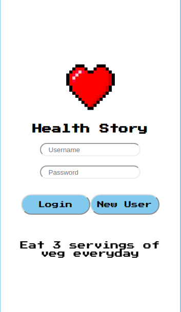
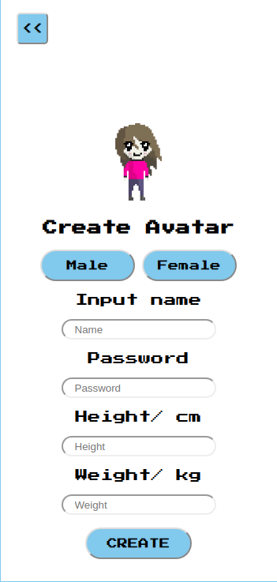
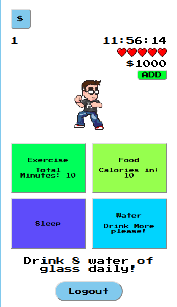
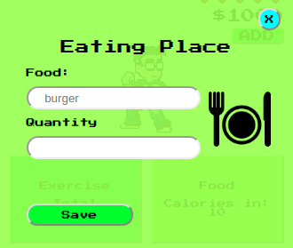
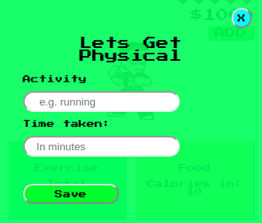
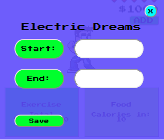
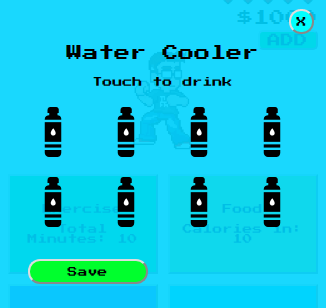
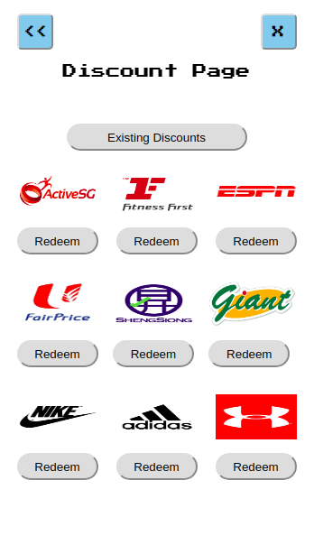

# Health App Prototype

## Description

Simple Health Tracking App Mockup, built using React

View [here](https://adamilyas.github.io/esa-documents/Cover%20Page/index.html) for more information on the project

## Screens

### Login 

### Register

### Home

### Eat

To track calories

Todo: Search input food from database to obtain calories, add to daily calories

### Physical

Todo: Search exercise type from database to obtain calories, subtract from daily calories

### Sleep

### Water

### Discount

